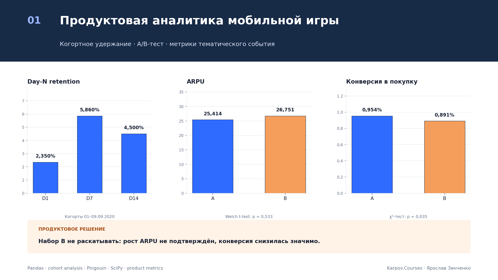
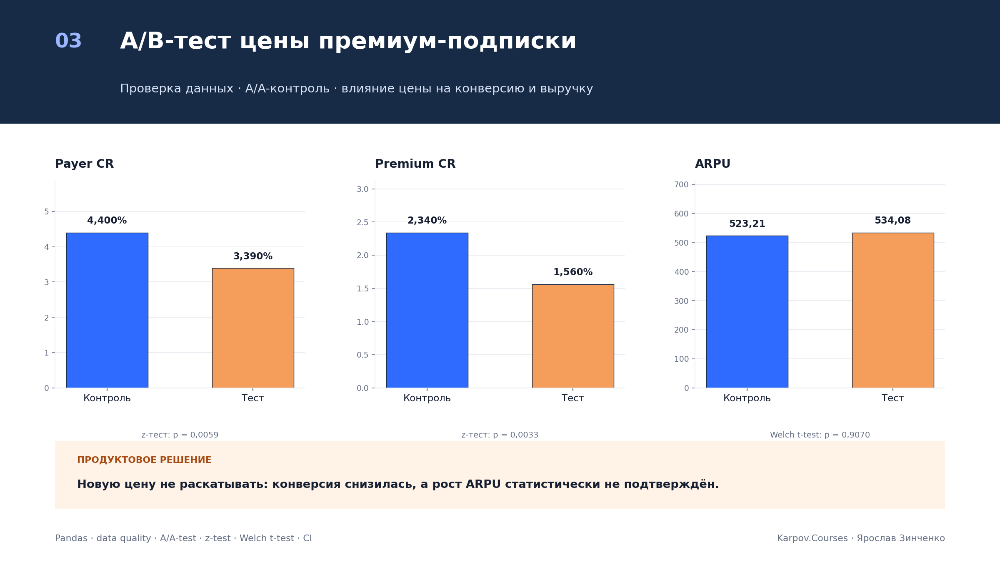

<div align="center">

# Учебные проекты по аналитике данных — Karpov.Courses


</div>

Репозиторий объединяет пять учебных проектов по продуктовой аналитике, A/B-тестам, SQL, BI и прогнозированию метрик. В каждом проекте сохранены постановка задачи, данные, воспроизводимые расчёты, ограничения и бизнес-вывод.

## Три варианта финального проекта

### 1. [Продуктовая аналитика мобильной игры](project-1-mobile-game-analytics/)

<a href="project-1-mobile-game-analytics/">
  
</a>

Когортное удержание, A/B-тест акционных предложений и система метрик тематического события. Набор B не рекомендован к запуску: рост ARPU не подтверждён, а конверсия снизилась статистически значимо.

[Открыть проект](project-1-mobile-game-analytics/) · [Ноутбук](project-1-mobile-game-analytics/notebooks/final_project_variant_1.ipynb) · [Отчёт](project-1-mobile-game-analytics/reports/final_report.md)

### 2. [A/B-тест оплаты и сегментация клиентов](project-2-payment-ab-segmentation/)

<a href="project-2-payment-ab-segmentation/">
  
</a>

Оценка новой механики оплаты, статистические тесты, проверка аномального пика платежей и SQL-сегментация клиентов. Одного роста ARPPU недостаточно для продуктового запуска.

[Открыть проект](project-2-payment-ab-segmentation/) · [Полный ноутбук](project-2-payment-ab-segmentation/notebooks/project_2_full.ipynb) · [SQL](project-2-payment-ab-segmentation/sql/customer_segmentation.sql)

### 3. [A/B-тест цены премиум-подписки](project-3-premium-price-ab-test/)

<a href="project-3-premium-price-ab-test/">
  
</a>

Проверка качества транзакций, A/A-контроль и оценка влияния новой цены. Конверсия снизилась, а рост ARPU не получил статистического подтверждения.

[Открыть проект](project-3-premium-price-ab-test/) · [Ноутбук](project-3-premium-price-ab-test/notebooks/project_3_variant_3.ipynb) · [Разбор по шагам](project-3-premium-price-ab-test/docs/project_3_step_by_step_explanation.md)

## Навигация по проектам

| № | Проект | Главный результат | Инструменты |
|---:|---|---|---|
| 1 | [Продуктовая аналитика мобильной игры](project-1-mobile-game-analytics/) | Набор предложений B не следует раскатывать: рост ARPU не подтверждён, а конверсия снизилась | Python, Pandas, SciPy, Pingouin, когортный анализ |
| 2 | [A/B-тест оплаты и сегментация клиентов](project-2-payment-ab-segmentation/) | Новая механика оплаты не улучшила ARPU и конверсию; одного роста ARPPU недостаточно для запуска | Python, Statsmodels, PostgreSQL, SQL |
| 3 | [A/B-тест цены премиум-подписки](project-3-premium-price-ab-test/) | Более высокая цена снизила конверсию и не дала доказанного роста ARPU | Python, SciPy, Statsmodels, A/A- и A/B-тесты |
| 4 | [Продуктовый дашборд ленты и мессенджера](project-4-superset-product-dashboard/) | Собран мониторинг DAU, пересечения сервисов и структуры отправителей сообщений | Apache Superset, ClickHouse, SQL, BI |
| 5 | [Оценка эффекта флэшмоба](project-5-flashmob-causal-impact/) | Флэшмоб краткосрочно усилил потребление контента, но не дал убедительного роста DAU | CausalImpact, TensorFlow Probability, ClickHouse |

## Единый стандарт анализа

Все проекты приведены к общей логике:

1. формулировка бизнес-вопроса и основной метрики;
2. описание источника и единицы анализа;
3. проверка качества данных до расчётов;
4. отделение описательных результатов от статистических выводов;
5. решение, основанное на основной метрике, размере эффекта и неопределённости;
6. явные ограничения и следующий практический шаг.

Подробные формулы и правила интерпретации собраны в [методической заметке](docs/logic_and_formulas.md).

## Что важно при чтении результатов

- `p-value ≥ 0,05` не доказывает отсутствие эффекта — данных может быть недостаточно.
- Значимый рост вспомогательной метрики не заменяет результат по заранее выбранной основной метрике.
- Данные наблюдений и квазиэксперименты не дают такой же силы причинного вывода, как рандомизированный A/B-тест.
- Денежные метрики считаются на уровне пользователя; пользователи без оплаты остаются в знаменателе ARPU и конверсии.
- Для продуктового решения статистическая значимость дополняется размером эффекта, рисками и защитными метриками.

## Воспроизведение

```bash
git clone https://github.com/sureasguuds9-prog/karpov-courses-projects.git
cd karpov-courses-projects
python -m venv .venv
source .venv/bin/activate
pip install -r project-2-payment-ab-segmentation/requirements.txt
jupyter lab
```

Откройте нужный ноутбук и выполните все ячейки сверху вниз. Учебные исходные CSV для проектов 1–3 не публикуются в GitHub; порядок их размещения описан внутри соответствующих проектов. Ноутбуки содержат сохранённые результаты расчётов. Для просмотра проекта 4 может потребоваться авторизация в учебном Superset.

## Как читать проекты

Каждое решение построено в одной последовательности: **бизнес-вопрос → качество данных → метрики → статистическая проверка → решение → ограничения**. Preview-изображения генерируются воспроизводимым скриптом [`scripts/build_project_previews.py`](scripts/build_project_previews.py) из зафиксированных итоговых метрик.

## Автор

Ярослав Зинченко
