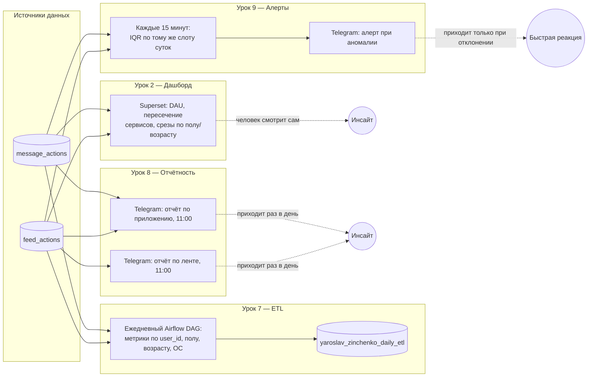

# Финальный проект: конвейер мониторинга приложения

От первого дашборда до автономных алертов — уроки 2, 7, 8 и 9 симулятора
образуют один сквозной конвейер наблюдения за продуктом (лента + мессенджер).
Каждый следующий шаг снимает ограничение предыдущего: дашборд требует, чтобы
кто-то на него посмотрел; ETL готовит данные для этого взгляда; отчёты
приносят взгляд человеку сами; алерты убирают из цепочки ожидание «человек
посмотрит вовремя» и оставляют только момент, когда это действительно важно.

## Зачем нужен именно такой порядок

| Ступень | Урок | Вопрос, который она закрывает | Чего ей не хватает |
|---|---|---|---|
| 1. Дашборд | [2. Первый дашборд](../simulator-projects/02_Первый_дашборд/) | «Как посмотреть на метрики, когда я сам захочу?» | Требует, чтобы кто-то зашёл и посмотрел |
| 2. ETL | [7. ETL-пайплайн](../simulator-projects/07_ETL_пайплайн/) | «Как готовить агрегаты по пользователю/полу/возрасту/ОС заранее, а не считать на лету?» | Данные готовы, но никто не уведомлён |
| 3. Отчётность | [8. Автоматизация отчётности](../simulator-projects/08_Автоматизация_отчетности/) | «Как приносить инсайт человеку, а не ждать, что он зайдёт?» | Раз в день; аномалия внутри дня останется незамеченной 24 часа |
| 4. Алерты | [9. Поиск аномалий](../simulator-projects/09_Поиск_аномалий/) | «Как узнать про сбой за 15 минут, а не за сутки?» | Требует продуманного порога, иначе шум |

Дашборд из урока 2 остаётся источником истины для глубокого разбора причин:
именно на него ссылается алерт, когда нужно посмотреть на картину целиком
([продуктовый дашборд ленты и мессенджера](../project-4-superset-product-dashboard/)).

## Единая модель данных

Все четыре ступени читают одни и те же два источника —
`simulator_20260720.feed_actions` и `simulator_20260720.message_actions` —
и намеренно используют одинаковое определение активности:

- **активный пользователь ленты** — есть `view` или `like` за период;
- **активный пользователь мессенджера** — есть отправленное сообщение за период;
- **пересечение сервисов** — пользователь активен в обеих частях приложения.

Это определение зафиксировано в дашборде урока 2, повторено в агрегатах ETL
урока 7, в тексте отчётов урока 8 и в baseline алертов урока 9 — поэтому
цифры на всех четырёх ступенях сопоставимы друг с другом.

## Метод обнаружения аномалий (ядро урока 9)

Задание прямо предупреждает: доверительный интервал «на весь день» даёт
эффект «среднего по больнице» и низкую чувствительность. Поэтому:

1. Для текущего 15-минутного интервала берём значения метрики в **тот же**
   час:минута за предыдущие 14 дней (а не соседние часы того же дня).
2. Считаем квартили Тьюки: `Q1`, `Q3`, `IQR = Q3 - Q1`,
   коридор `[Q1 - 1.5·IQR; Q3 + 1.5·IQR]`.
3. Аномалия = точка вне коридора **и** отклонение от медианы ≥ 10% —
   так убираем ложные срабатывания на метриках со случайно узким IQR.

Пропущенные интервалы (когда событий не было совсем) явно заполняются
нулями — отсутствие данных тоже сигнал, и его нельзя терять при склейке.
Это первая, сознательно простая версия (без ML), как и рекомендует задание:
сначала работающее решение, усложнение — отдельный следующий шаг.

## Куда развивать конвейер дальше

- **Сезонность внутри недели.** Сейчас baseline не различает будни и
  выходные; можно строить его отдельно по дню недели.
- **Целевые уровни в дашборде.** Дашборд урока 2 показывает динамику, но не
  показывает пороги — те же границы IQR можно вывести на него как ориентир.
- **Групповые алерты.** Сейчас каждая метрика проверяется независимо; можно
  добавить составной сигнал «упало сразу несколько метрик одновременно».
- **Разбор инцидента одним кликом.** В сообщение алерта можно добавить
  прямую ссылку на дашборд с уже выставленным периодом инцидента.

## Границы текущей версии

- Метод не различает разовый выброс и начало устойчивого сдвига — оба дадут
  один и тот же алерт.
- 14 дней истории может быть недостаточно для метрик с сильной сезонностью
  по дням недели или праздникам.
- Фактическая работа DAG урока 9 в проде подтверждается отдельно после
  включения — заранее выдуманный результат здесь не публикуется, в духе
  общего правила подборки: отсутствующее подтверждение не заменяется
  придуманным.
