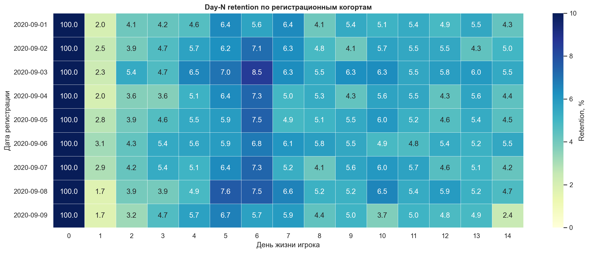
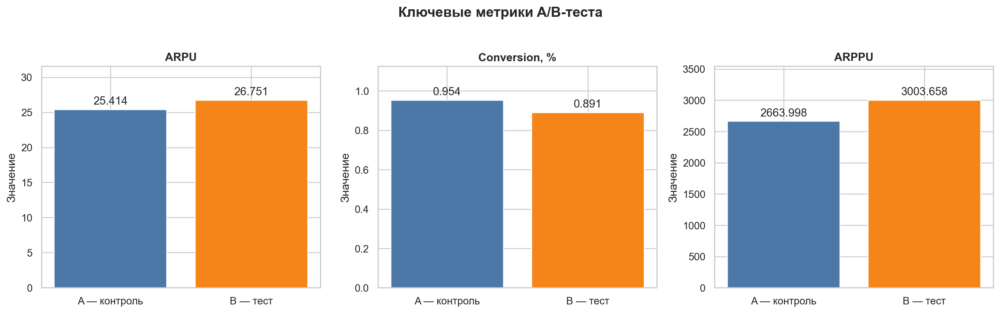

# Продуктовая аналитика мобильной игры


Финальный учебный проект по трём задачам: когортное удержание, A/B-тест акционных предложений и проектирование метрик тематического события.

## Краткий вывод

Набор предложений **B пока нельзя считать победителем**. ARPU вырос на 5,26%, но статистически значимый эффект не обнаружен (`p = 0,533`). Конверсия в покупку снизилась на 6,64% относительно контроля (`p = 0,035`). В группе A найден небольшой кластер крупных плательщиков, формирующий основную часть её выручки, поэтому перед повторным тестом необходимо проверить логирование и баланс игроков по историческому LTV.

| Показатель | Результат |
|---|---:|
| Удержание D1 / D7 / D14 | 2,35% / 5,86% / 4,50% |
| ARPU, A → B | 25,414 → 26,751 |
| Конверсия, A → B | 0,954% → 0,891% |
| ARPPU, A → B | 2 663,998 → 3 003,658 |
| Решение | не раскатывать B без повторного теста |

> Удержание рассчитано как классическое удержание дня N для последних полностью наблюдаемых когорт 1–9 сентября 2020 года на горизонте D0–D14.

## Бизнес-задачи

1. Рассчитать удержание по регистрационным когортам.
2. Проверить, улучшает ли набор предложений B денежный результат.
3. Спроектировать систему метрик тематического события и механики отката прогресса.

## Методика

- основная метрика эксперимента — ARPU;
- конверсия и ARPPU используются как диагностические метрики;
- для конверсии применяется критерий хи-квадрат, для ARPU и ARPPU — t-тест Уэлча;
- выбросы не удаляются после просмотра результата: их происхождение проверяется отдельно;
- метрики события образуют цепочку «охват → старт → прогресс → завершение → награда → удержание и монетизация».

## Основные визуализации





## Ограничения

- два файла регистраций и авторизаций не хранятся в GitHub из-за размера;
- необычное распределение выручки требует проверки логирования и правил таргетинга;
- сравнение участников события с неучастниками без рандомизации подвержено смещению самоотбора.

## Состав проекта

```text
project-1-mobile-game-analytics/
├── notebooks/final_project_variant_1.ipynb  # выполненный анализ
├── src/retention.py                         # функция расчёта удержания
├── tests/test_retention.py                  # модульные тесты
├── reports/final_report.md                  # итоговый отчёт
├── figures/                                 # сохранённые графики
├── data/README.md                           # подключение исходных данных
└── scripts/validate_project.py              # проверка структуры проекта
```

## Воспроизведение

```bash
python -m venv .venv
source .venv/bin/activate
pip install -r requirements.txt
pytest
jupyter lab notebooks/final_project_variant_1.ipynb
```

Порядок подключения крупных файлов описан в [`data/README.md`](data/README.md). Полный управленческий вывод находится в [`reports/final_report.md`](reports/final_report.md), а общие формулы — в [`../docs/logic_and_formulas.md`](../docs/logic_and_formulas.md).
