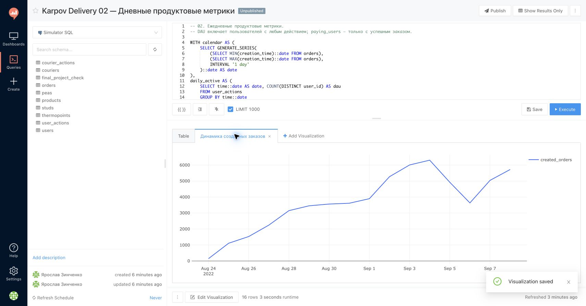
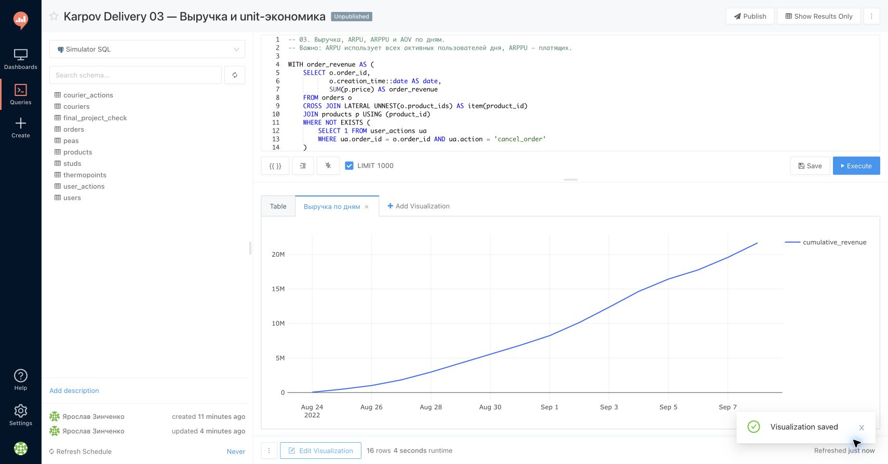
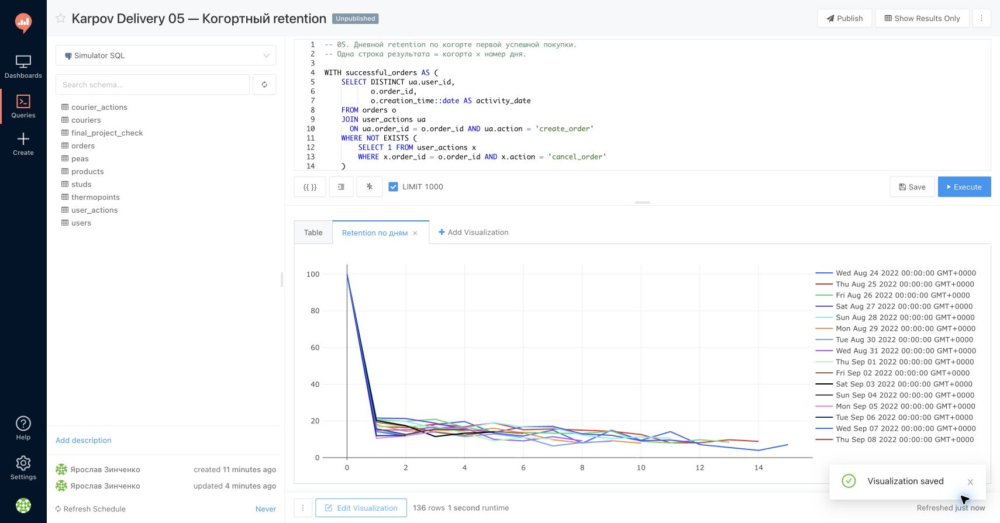
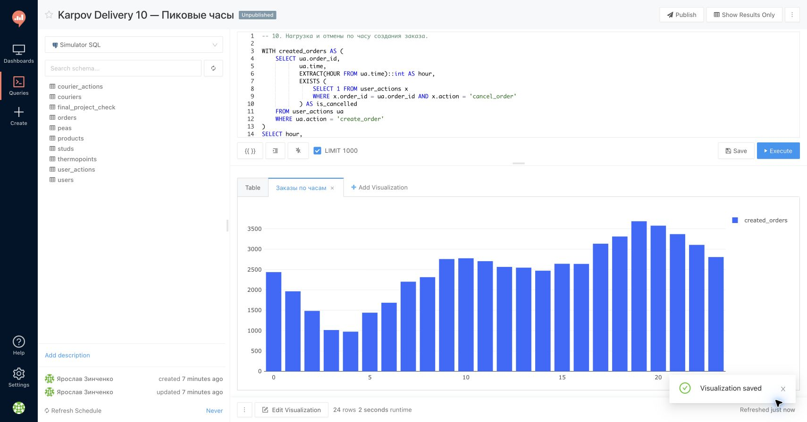
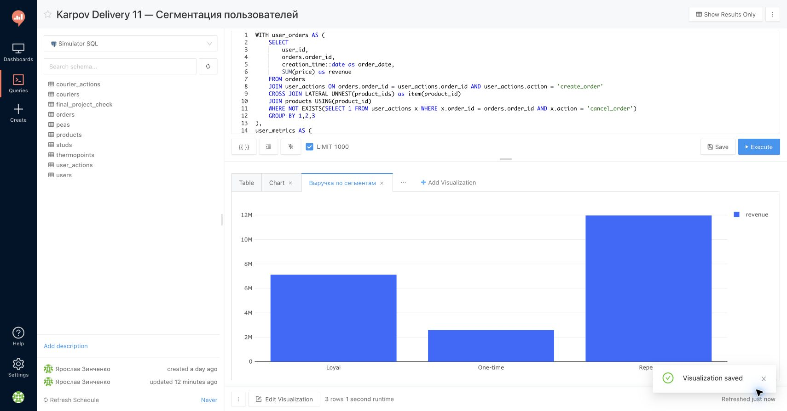
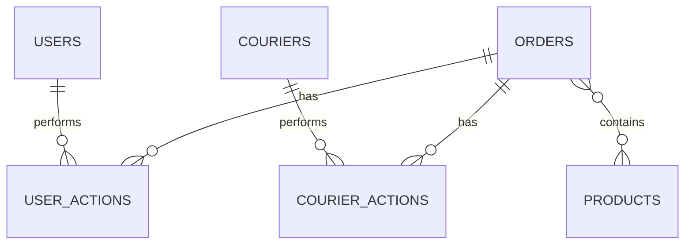

# Аналитика сервиса доставки — SQL + Redash

Портфолио-проект уровня **Strong Junior Data Analyst** на PostgreSQL и Redash. В проекте я прошёл полный аналитический цикл: проверил качество данных, построил витрины и метрики, выполнил 12 SQL-запросов в `Simulator SQL`, создал 5 визуализаций и сформулировал бизнес-выводы.

> Период данных: **24 августа — 8 сентября 2022 года**. Все числа ниже получены при live-выполнении запросов в Redash 3 августа 2026 года.

## Главное за 30 секунд

| Метрика | Результат |
|---|---:|
| Заказы в исходной таблице | 59 595 |
| Успешные заказы | 56 616 |
| Доля успешных заказов | 95,0% |
| Выручка | 21 679 095 |
| Средний чек за период | 382,91 |
| Пользователи с успешными заказами | 21 088 |
| Среднее время доставки | 19,95 мин |
| Час максимальной нагрузки | 19:00 — 3 685 заказов |

## Бизнес-задача

Руководству сервиса доставки нужно понять:

- растут ли аудитория, заказы и выручка;
- насколько стабильно заказ проходит от создания до доставки;
- возвращаются ли пользователи после первой покупки;
- какие товары и пользовательские сегменты создают выручку;
- насколько эффективно работают курьеры и когда возникает пиковая нагрузка.

## Ключевые выводы

1. **Операционный контур работает стабильно.** Доля отмен за весь период — 5,0%, а дневная конверсия из создания заказа в доставку находится примерно в диапазоне 94–96%. Дубликаты ключей, пустые массивы товаров и потерянные связи не обнаружены.
2. **Сервис быстро масштабируется в пределах учебного окна.** Дневная выручка выросла с 49 924 до 2 099 508, а накопленная выручка достигла 21 679 095. Рост нельзя экстраполировать за пределы короткого 16-дневного периода.
3. **Повторные пользователи — основной источник денег.** Сегмент `Repeat` формирует 55% выручки, `Loyal` — 33%, а `One-time` — только 12%. Значит, развитие второго и последующих заказов потенциально важнее разовых промо на первую покупку.
4. **Основная нагрузка приходится на вечер.** Максимум зафиксирован в 19:00: 3 685 созданных заказов, 3 496 успешных заказов и 5,13% отмен. С 18:00 до 21:00 системе и курьерской службе нужен повышенный резерв мощности.
5. **Retention после первого заказа умеренный.** Для самой ранней когорты D1 составил 14,17%; взвешенный D1 по доступным зрелым когортам — 16,79%. Уже на следующий день теряется более 80% когорты, поэтому стоит тестировать сценарии повторного заказа.
6. **Выручка не зависит от одного товара.** Лидер — свинина с 1 353 600 выручки и долей 6,24%; следующие позиции — курица и оливковое масло. Топ-8 товаров формируют около 32,9% выручки.

## Визуализации Redash

### Динамика заказов



### Накопленная выручка



### Retention по когортам



### Пиковые часы



### Выручка по пользовательским сегментам



## Данные и логика

| Таблица | Основные поля | Назначение |
|---|---|---|
| `orders` | `order_id`, `creation_time`, `product_ids` | состав и время создания заказа |
| `user_actions` | `user_id`, `order_id`, `action`, `time` | создание и отмена заказов |
| `courier_actions` | `courier_id`, `order_id`, `action`, `time` | принятие и доставка заказов |
| `users` | `user_id`, `birth_date`, `sex` | пользователи |
| `couriers` | `courier_id`, `birth_date`, `sex` | курьеры |
| `products` | `product_id`, `name`, `price` | товары и цены |

Основная единица анализа — **неотменённый заказ**: есть `create_order`, но отсутствует `cancel_order`. Выручка заказа — сумма цен товаров после `CROSS JOIN LATERAL UNNEST(product_ids)`. Действия пользователей и курьеров предварительно агрегируются до уровня заказа, чтобы не размножать строки при `JOIN`.



Подробный словарь: [docs/data_dictionary.md](docs/data_dictionary.md).

## SQL-анализ

Все запросы собраны в [`all_queries.sql`](all_queries.sql) и продублированы отдельными файлами:

1. [`00_data_quality.sql`](sql/00_data_quality.sql) — дубликаты, пустые массивы, потерянные связи, отмены.
2. [`01_clean_orders.sql`](sql/01_clean_orders.sql) — витрина успешных заказов.
3. [`02_daily_metrics.sql`](sql/02_daily_metrics.sql) — DAU, платящие пользователи, заказы, доставки.
4. [`03_revenue_unit_economics.sql`](sql/03_revenue_unit_economics.sql) — Revenue, ARPU, ARPPU, AOV.
5. [`04_product_funnel.sql`](sql/04_product_funnel.sql) — воронка от создания до доставки.
6. [`05_retention.sql`](sql/05_retention.sql) — дневной cohort retention.
7. [`06_cohort_revenue.sql`](sql/06_cohort_revenue.sql) — когортная и накопленная выручка.
8. [`07_marketing_campaigns.sql`](sql/07_marketing_campaigns.sql) — шаблон анализа кампаний.
9. [`08_courier_efficiency.sql`](sql/08_courier_efficiency.sql) — скорость и нагрузка курьеров.
10. [`09_product_assortment.sql`](sql/09_product_assortment.sql) — вклад товаров в продажи и выручку.
11. [`10_peak_hours.sql`](sql/10_peak_hours.sql) — нагрузка и отмены по часу.
12. [`11_user_segments.sql`](sql/11_user_segments.sql) — сегментация по частоте заказов.

Фактические ссылки на сохранённые запросы и статус проверки: [docs/redash_execution_report.md](docs/redash_execution_report.md).

## Рекомендации

- запустить триггерные коммуникации после первого заказа и измерять инкрементальный D7/D14 retention;
- отдельно управлять сегментом `One-time`: он включает 6 695 пользователей, но формирует лишь 12% выручки;
- усиливать курьерские смены и мониторинг инфраструктуры в интервале 18:00–21:00;
- контролировать отмены по часам вместе с нагрузкой, а не только среднее значение 5%;
- добавить стоимость привлечения и реальные списки участников кампаний перед расчётом CAC, ROMI или ROI.

## Ограничения

- это учебная база; выводы показывают аналитический подход, а не состояние реального бизнеса;
- период короткий — 16 дней, поэтому долгосрочный тренд и сезонность не подтверждены;
- цены берутся из текущего справочника `products`, исторических цен нет;
- в данных нет расходов на маркетинг и состава кампаний, поэтому запрос `07` корректно возвращает пустой результат до заполнения `campaign_users`;
- связь метрик не доказывает причинность: рекомендации требуют экспериментов или дополнительной диагностики.

## Структура репозитория

```text
karpov-delivery-sql-analytics/
├── README.md
├── all_queries.sql
├── sql/                         # 12 SQL-запросов
├── assets/screenshots/          # 5 проверенных Redash-визуализаций
├── docs/
│   ├── data_dictionary.md
│   ├── redash_dashboard.md
│   └── redash_execution_report.md
├── LICENSE
└── .gitignore
```

## Что демонстрирует проект

- уверенное владение `CTE`, `JOIN`, `GROUP BY`, `FILTER`, `CASE`, оконными функциями и `UNNEST`;
- контроль гранулярности и защита от размножения строк;
- продуктовые метрики, unit-экономику, когорты, retention и сегментацию;
- работу в Redash: live-проверку запросов, настройку визуализаций и интерпретацию результата;
- честное разделение фактов, гипотез, рекомендаций и ограничений.
